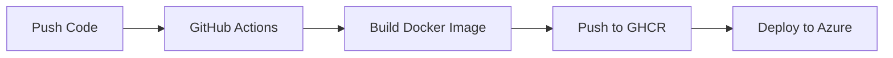

# NATS Server - GitHub-Based Deployment Guide

## Quick Start

### 1. Push to GitHub

```powershell
# Initialize git repository (if not already done)
git init
git add .
git commit -m "Initial NATS server setup"

# Create a new repository on GitHub, then:
git remote add origin https://github.com/YOUR-USERNAME/nats-server.git
git branch -M main
git push -u origin main
```

### 2. Make Container Image Public

After the GitHub Actions workflow completes:

1. Go to your GitHub repository
2. Click on "Packages" in the right sidebar
3. Click on the `nats-server` package
4. Click "Package settings"
5. Scroll down to "Danger Zone"
6. Click "Change visibility" → "Public"

### 3. Deploy to Azure

```powershell
.\deploy-from-github.ps1 -GithubUsername "YOUR-USERNAME"
```

Replace `YOUR-USERNAME` with your actual GitHub username.

## How It Works

1. **GitHub Actions**: Automatically builds the Docker image when you push to `main`
2. **GHCR**: Stores the image in GitHub Container Registry (ghcr.io)
3. **Azure**: Pulls the image from GHCR and deploys to Container Instances

## Workflow



## Making Changes

To update your NATS configuration:

1. Edit `nats-server.conf`
2. Commit and push:
   ```powershell
   git add nats-server.conf
   git commit -m "Update NATS configuration"
   git push
   ```
3. Wait for GitHub Actions to complete (~1-2 minutes)
4. Redeploy to Azure:
   ```powershell
   # Delete old container
   az container delete --resource-group StoreOne --name nats-server-storeone --yes
   
   # Deploy new version
   .\deploy-from-github.ps1 -GithubUsername "YOUR-USERNAME"
   ```

## Advantages

✅ **No Docker Hub issues** - Uses GitHub's reliable registry  
✅ **Automated builds** - Every push triggers a new build  
✅ **Version control** - Track all configuration changes  
✅ **Free hosting** - GitHub Packages free for public repos  
✅ **Easy rollback** - Deploy specific commits using tags

## Troubleshooting

### "Image not accessible" error

Make sure the container image is **public**:
1. Go to https://github.com/YOUR-USERNAME?tab=packages
2. Click on `nats-server`
3. Make it public in settings

### GitHub Actions failing

Check the Actions tab in your repository for error details.

### Need authentication for private images

If you want to keep the image private:

```powershell
# Create a GitHub Personal Access Token with read:packages permission
# Then deploy with:
az container create `
    --registry-login-server ghcr.io `
    --registry-username YOUR-USERNAME `
    --registry-password YOUR-GITHUB-TOKEN `
    ... (other parameters)
```
